### **Introduction**

Flow Control is a set of procedures at the Data Link Layer that controls the flow of data between the sender and the receiver. It allows two stations working at different speeds to communicate effectively. It comprises measures taken to regulate the data the sender transmits to the receiver, so no problem arises if the sender sends data at a higher rate than the receiver can support. To solve this issue, **Flow Control** is introduced in the Data Link Layer. It informs the sender how much data should be sent to the receiver so that data is not lost. The main purpose of Flow Control is to improve **efficiency** in computer networks. To achieve this, there are various flow control protocols classified as:

  
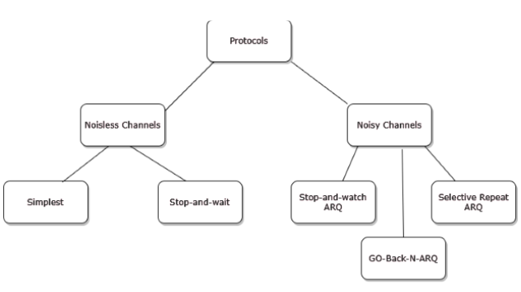
<figcaption><strong>Fig. 1 Flow Control Protocols</strong></figcaption> 

  
Protocols in the first category cannot be used in real life, but they serve as a basis for understanding protocols designed for noisy channels.

All protocols discussed here are unidirectional, meaning data frames travel from one node, called the sender, to another node, called the receiver. Although special frames called acknowledgment (ACK) and negative acknowledgment (NAK) can flow in the opposite direction for flow and error control, data flows only in one direction. In real-life networks, data link protocols are implemented as bidirectional; data flows in both directions. In these protocols, flow and error control information such as ACKs and NAKs are included in data frames using a technique called piggybacking. Because bidirectional protocols are more complex than unidirectional ones, we focus on the latter for this discussion.

### **Simplest Protocol**

The simplest protocol is the Elementary Data Link Protocol. Since it is used in noiseless channels, it has no error control and no flow control. It assumes that the receiver is always ready to immediately handle any frames coming from the sender. The simplest protocol is unidirectional, with data frames traveling in only one direction—from the sender to the receiver.

Since the simplest protocol is unidirectional, there is no acknowledgment (ACK). Also, because there is no data loss in transmission, there is no need for data retransmission.

### **Design**

The data link layer at the sender side gets data from its network layer, frames the data, and sends it. The data link layer at the receiver side receives frames from its physical layer, extracts the data, and passes it to its network layer. The data link layers at both sender and receiver provide communication services to their network layers. They utilize the physical layers’ services for the physical transmission of bits.

  
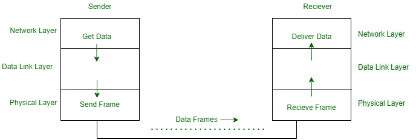
<figcaption><strong>Fig. 2 The data transfer and design of the simplest protocol.</strong></figcaption>

  

### **Stop and Wait**

This protocol provides unidirectional data transmission with flow control but without error control. The transmit and receive window sizes are both set to **one**. Regardless of the number of packets the sender has, the Stop and Wait protocol requires only two sequence numbers: 0 and 1.

**Sender Rules:**  
1. Send one data packet at a time.  
2. Send the next packet only after receiving an acknowledgment for the previous one.

**Receiver Rules:**  
1. Receive and consume the data packet.  
2. After consuming the packet, send an acknowledgment (flow control).

  
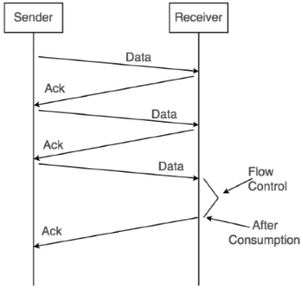
<figcaption><strong>Fig. 3 Working of Stop and Wait</strong></figcaption>

  
 
### **Advantages:**

1. It is very simple to implement.
2. The incoming packet from the receiver is always an acknowledgment.
 

### **Limitations:**

1. It is extremely inefficient because:
   - It makes the transmission process extremely slow.
   - It does not use the bandwidth efficiently, as each single packet and acknowledgment take the entire time to traverse the link.

2. If the data packet sent by the sender gets lost:
   - The sender will keep waiting for the acknowledgment indefinitely.
   - The receiver will keep waiting for the data packet indefinitely.

3. If the acknowledgment sent by the receiver gets lost:
   - The sender will keep waiting for the acknowledgment indefinitely.
   - The receiver will keep waiting for another data packet indefinitely.

### **Stop and Wait ARQ**

This protocol adds a simple error control mechanism to the Stop-and-Wait Protocol. Error control in the data link layer is often implemented simply: any time an error is detected in an exchange, specified frames are retransmitted. This process is called automatic repeat request (ARQ).

### **This protocol involves the following transitions:**

- The sender sends one frame at a time and waits for the acknowledgment.
- Once the receiver receives a valid frame, it sends an acknowledgment frame back to the sender.
- On receiving the acknowledgment frame, the sender understands that the receiver is ready to accept the next frame and sends the next frame in the queue.
- If the ACK does not reach the sender before a certain time, known as the timeout, the sender retransmits the same frame. The timeout countdown is reset after each frame transmission.

<b>Stop and Wait ARQ =</b> Stop and Wait + Timeout timer + Sequence number

### **NOTE:**  
1. In Stop-and-Wait ARQ, sequence numbers are used to number the frames. The sequence numbers are based on modulo-2 arithmetic.  
2. In Stop-and-Wait ARQ, the acknowledgment number always announces, in modulo-2 arithmetic, the sequence number of the next frame expected.

### **How Stop and Wait ARQ Solves All Problems?**

The problems of Stop-and-Wait are resolved by Stop and Wait ARQ that performs both error control and flow control.

### **1. Problem of Lost Data Packet**

- Timeout timer helps solve the problem of lost data packets.

 
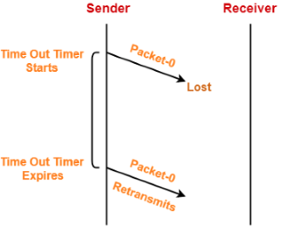
<figcaption><strong>Fig. 4 Solution for Lost Data Packet</strong></figcaption>

### **2. Problem of Lost Acknowledgment**

- Consider the acknowledgment sent by the receiver gets lost.
- Then, the sender retransmits the same data packet after its timer goes off.
- The sequence number on the data packet helps the receiver identify the duplicate data packet.
- Receiver discards the duplicate packet and re-sends the same acknowledgment.

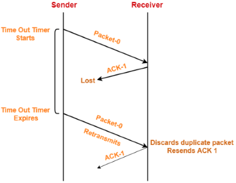
<figcaption><strong>Fig. 5 Solution for Lost Acknowledgment</strong></figcaption>

### **3. Problem of Delayed Acknowledgment**

- Sequence numbers on acknowledgments help solve the problem of delayed acknowledgment.

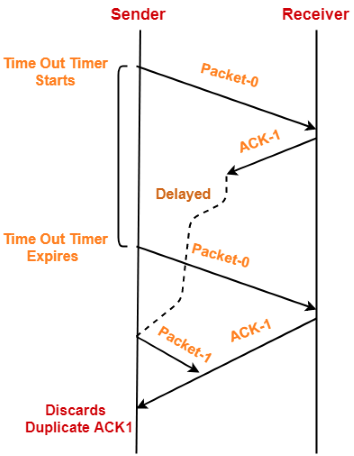
<figcaption><strong>Fig. 6 Solution for Delayed Acknowledgment</strong></figcaption>

### **4. Problem of Damaged Packet**

- If the receiver receives a corrupted data packet from the sender, it sends a negative acknowledgment (NAK) to the sender.
- NAK requests the sender to resend the data packet.

<figcaption><strong>Fig. 7 Solution for Damaged Packet</strong></figcaption>

### **Working of Stop and Wait ARQ:**

1. Sender A sends a data frame or packet with sequence number 0.
2. Receiver B, after receiving the data frame, sends an acknowledgment with the sequence number of the next expected frame or packet.  
   There is only a one-bit sequence number, implying that both sender and receiver have buffer for one frame or packet only.

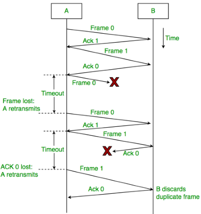
<figcaption><strong>Fig. 8 Working of Stop and Wait ARQ</strong></figcaption>

### **Few Terminologies:**

**1. Transmission Delay (Tt)**: The time required to transmit the entire packet from the host onto the outgoing link.

Where,  
- **D**: Data size to transmit  
- **B**: Bandwidth of the link  
 

**2. Propagation Delay (Tp)**: The time taken by the first bit transmitted by the host onto the outgoing link to reach the destination.

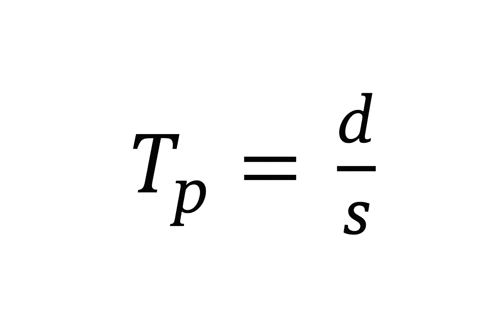

where
- **d** : distance,</li>
- **s** : the wave propagation speed (depends on the characteristics ofmedium). 
   
**3. Efficiency of stop-and-wait ARQ (η)**

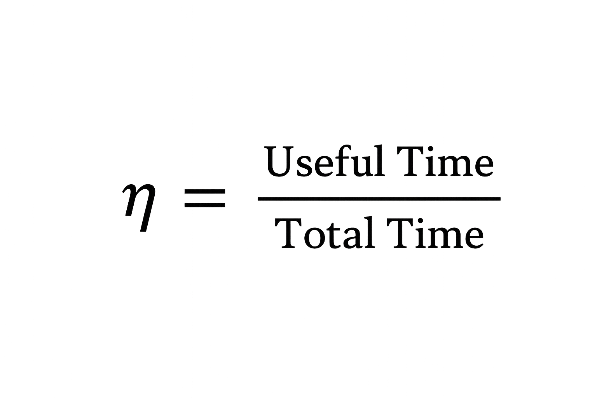

where,       
- **Useful time** = Transmission delay of data packet = (Transmission) packet 
- **Useless time** = Time for which sender is forced to wait and do nothing = 2 x Propagation delay 
- **Total time** = Useful time + Useless time

Thus, 

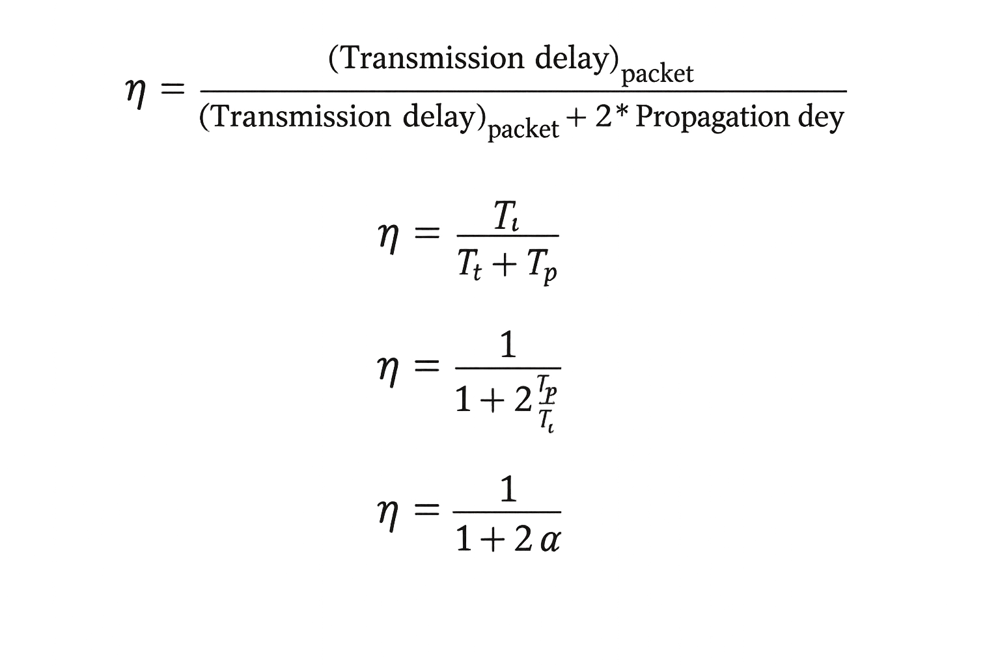

where,     

  
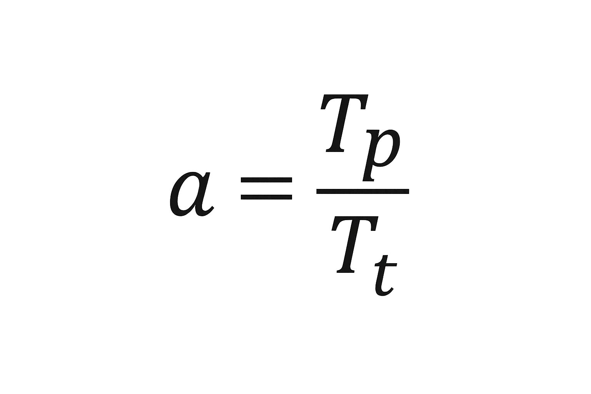

### **Advantages:** 
                    
<ul>
 <li>It is very simple to implement.</li>
 <li>The incoming packet from receiver is always an acknowledgement.</li>
 <li>Easy error handling – Lost or corrupted frames are simply retransmitted, maerror recovery straightforward.</li>
 <li>Low memory usage</li>
</ul>
 
### **Disadvantages:**
 <ul>
     <li>Inefficient</li>
     <li>Low throughput</li>
     <li>High idle time</li>
     <li>Not suitable for long-distance or high-speed networks</li>
 </ul>

 